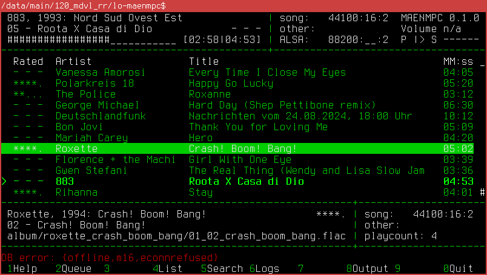
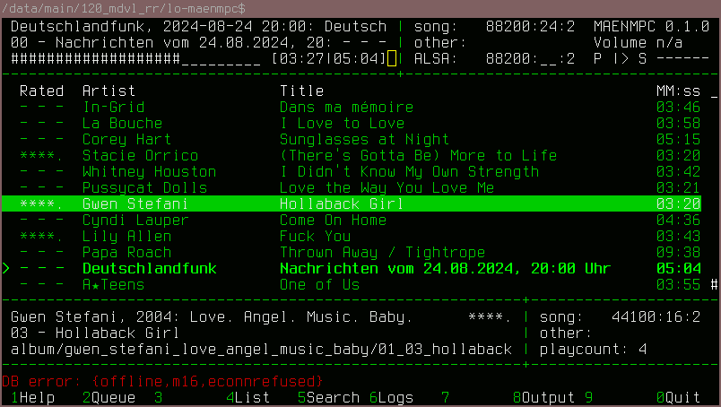
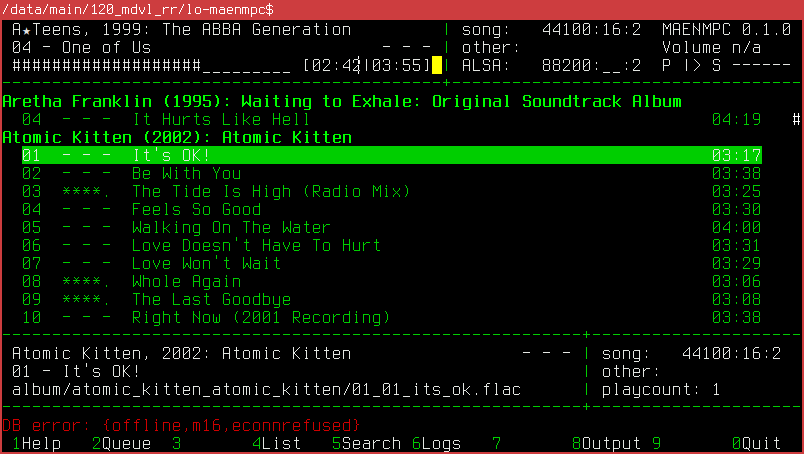
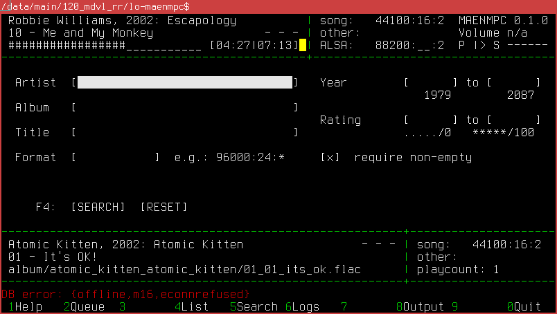
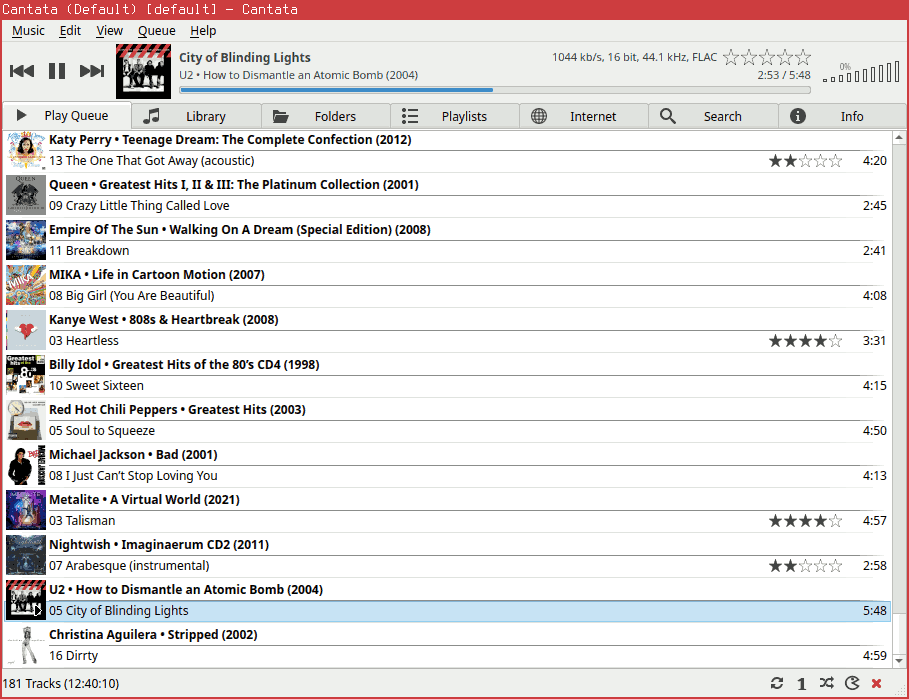
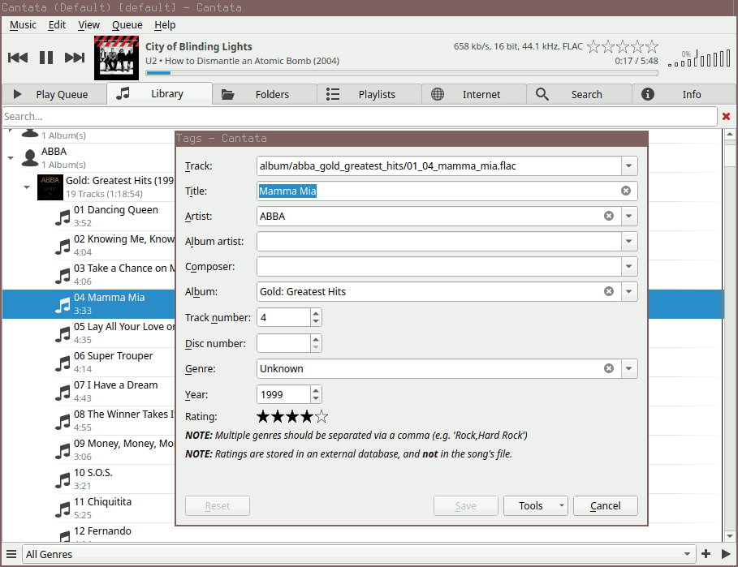

Background
==========

Initially, I set out with _gmusicbrowser_ <https://gmusicbrowser.org/> for my
music collection and playback needs which I extended running sidecar scripts as
described in [gmusicradio(32)](../32/gmusicradio.xhtml). To understand the full
background, start reading the _Background_ section on
[gmusicradio(32)](../32/gmusicradio.xhtml). To skip over this background
details and history, continue reading at _Abstract_.

Then I got my hands on some AES67-enabled audio components and wondered how to
best get my audio output routed to them, cf.
[aes67_audio_notes(37)](../37/aes67_audio_notes.xhtml). It turned out that for
various reasons, a dedicated machine for playback to the speakers was a good
choice.

This got me looking for an audio player that could work with a music collection
consisting of two copies: One on the remote machine (offline resampled to the
sample rate of the speakers) and one on the local machine.

No existing program seemed to support this completely but the networked nature
of the Music Player Daemon
[mpd(1)](https://manpages.debian.org/bookworm/mpd/mpd.1.en.html) was promising
to provide a nice building block for such a setup. MPD does not come with native
support for stars-based ratings and play counts. These features are instead
addressed by various support programs. There are only a few clients that support
stars-based ratings.

Here are some useful programs to consider for these purposes:

Program      Type             License      Ratings?   Playcounts?  Link
-----------  ---------------  -----------  ---------  -----------  ---------------------------------------
Cantata      GUI client       GPL-3        stickers   no           <https://github.com/nullobsi/cantata>
myMPD        webinterface     GPL-3+       stickers   stickers     <https://github.com/jcorporation/myMPD>
RompЯ        webinterface     proprietary  own DB     own DB       <https://fatg3erman.github.io/RompR/>
mpdscrobble  scrobble client  Expat        no         scrobbles    <https://github.com/dbeley/mpdscrobble>
Maloja       scrobble server  GPL-3        no         scrobbles    <https://github.com/krateng/maloja>

The first entries are MPD clients that can be used to control the music
playback. The last entries are related to scrobble: While technically also a
client, a _scrobble client_ (aka. _scrobbler_) is specialized in tracking the
play counts. To do this, it usually runs non-interactively as a sidecar
daemon to MPD itself. A _scrobble_ is an uniquely identified datapoint that
marks that a given song was played once at a given time. The _scrobble server_
can be used to query aggregated information like the number of playbacks of
a given song.

Before creating my own client, I tested Cantata and RompЯ for some time. At the
time, myMPD didn't support stars-based ratings yet, causing it not to be
initially considered.

While both of the clients were working OK-ish, the UI did not really fit well
with my use cases and a setup with two dedicated MPD servers -- one for local
playback and one for the resampled collection to play back via AES67 -- e.g.
ratings would only be accessible from the “primary” client (where the stickers
database is saved). With Cantata I often fat-fignered replacing the current
song with the one under the cursor -- I don't want the music to be interrputed
mid-playing. Clients should always insert at the end of the queue or right
after the current song. With RompЯ I sometimes had volume control issues and
for AES67 this is very critical because a sudden jump to 100% volume means 97dB
from the speakers.

Finally, I usually prefer to use terminal user interfaces. Hence I thought about
creating my own terminal-based MPD client. This was eased by the fact that MPD
is designed to permit multiple clients to control it simultaneously. I could
stay with one of the existent clients and build features into my client on the
go and very early have it running along the other (more mature) client already.

Abstract
========

MAENMPC is an experimental terminal user interface (TUI) based MPD client.
It features some uncommon and some very uncommon features:

 * Full support for ratings by using the MPD stickers database.
   This includes searching by ratings and having the ratings displayed
   in all overviews and song listings.
 * Support for play counts by querying the Maloja API.
 * Support for scrobbling to a Maloja server.
 * Support for generating “radio-like” playlists based on the ratings and
   play counts. This is the same algorithm as implemented for
   [gmusicradio(32)](../32/gmusicradio.xhtml).
 * Support for news podcasts which are automatically enqueued into the
   playlist as a new episode appears.
 * Limited support for _multi-player_ operation, i.e. the client is able
   to connect to two MPD servers at once and make use of the metadata stored on
   the primary server even when playing through the second server as far as
   the second one has copies of the same songs. This works even with offline
   resampled copies.

Warning - Bugs and Complexity!
==============================

This program was created out of the necessity to have such a set of features
available in a manageable way. It has _many_ bugs and rough edges. It sometimes
deviates from general MPD client best practices in order to get an unique
feature or simplify the code.

It is thus advisable to prefer any other client and only turn to MAENMPC if you
really need (some of) the unique features and can accept to live with some bugs
in return. Some nice alternative clients to MAENMPC are described in section
_Summary of Impressions from other Clients_.

Finally, be aware that multiple programs need to be configured for MAENMPC to
work as designed:

 * MPD (version 0.24 or higher required)
 * Scrobble server (Maloja is required to use playcounts with MAENMPC)
 * podget (optional for news podcasts)
 * SSH server (if podcasts are to be copied to a remote machine for playback)

If you only want to try out the client, the minimum requirement is one running
MPD server. Debian stable's version 0.23.12 can be used such as long as the
search form's numeric fields (ratings, years) are not used.

Setup Instructions
==================

The recommended setup is to download and install the dependencies, configure
MAENMPC and then install it as a Debian package.

As an alternative option which lends itself better to “trying out” and
developing, the program can be compiled and run through `rebar3` as described
in subsection _Compiling and using rebar3 on any OS_.

## Compile-Time Dependencies

Install the compile-time dependencies:

	aptitude install ant devscripts erlang-base erlang-jiffy erlang-inets rebar3 libncurses-dev

### Installation using Packages on Debian-based OS

MAENMPC is written in Erlang. It makes use of libraries to draw its UI with
NCurses (`cecho`) and to communicate with MPD (`erlmpd`). In order to work
correctly with MAENMPC, both libraries have to be patched.

There are two way to go about this. If you are running a Debian-based system,
compile and install the following packages according to their build instructions:

 1. Install [erlmpd(32)](../32/erlmpd.xhtml) -- see _MDPC 2.0 Integration_
 2. Install cecho using the build instructions at
    <https://github.com/m7a/lp-cecho> as follows:

~~~
git clone https://github.com/m7a/lp-cecho
cd lp-cecho
ant package
sudo dpkg -i ../*.deb
~~~

### Compiling using rebar3 on any OS

If you are running another OS, it may well be possible to build with `rebar3`
alone. To do this, comment-in the lines in `rebar.config`:

~~~{.erlang}
{deps, [
	{cecho, {git, "https://github.com/m7a/cecho.git", {branch, "masysma_patches"}}},
	{erlmpd, {git, "https://github.com/m7a/bo-erlmpd.git", {branch, "master"}}}
]}.
~~~

Then you may build all of the necessary dependencies and MAENMPC in one step
using the following command:

	rebar3 release

After configuring (see next section), the following command may then be used to
run MAENMPC: `./_build/default/rel/maenmpc/bin/maenmpc foreground`

## Configuring

If you are going to install MAENMPC (may only be recommended after you are
happy with your configuration), you need to setup the config file first. If
you are using the `rebar3`-approach described under _Compiling using rebar3 on
any OS_ you can alternatively change the configuration at any time simply be
editing the file and restarting MAENMPC.

The example configuration file supplied with the program shows what could be
a productive setup. It is found under `config/sys.config`:

~~~{.erlang}
[{maenmpc, [
	{mpd, [
		{local, [{ip, {"172.17.0.1", 6600}}]},
		{m16,   [{ip, {"172.17.0.1", 6601}}]}
	]},
	{alsa, "/proc/asound/RAVENNA/pcm0p/sub0/hw_params"},
	{primary_ratings, local},
	{radio, #{
		schedule_len    => 60,
		chaos_factor    => 2.0,
		initial_factor  => 0.5,
		min_good_perc   => 30,
		default_rating  => 60,
		discard_prefix  => <<"epic/">>
	}},
	{maloja, [
		{url, "http://127.0.0.1:42010/apis/mlj_1"},
		{key, "NKPCt5Ej7vkilkRtx5EubIa4fG78xhPEbcljU49rHVjDUgV5WmEHl3VDHjZFDrQK"},
		{primary_albumart, local},
		{scrobble_send, true},
		{scrobble_file, "scrobble_test.txt"}
	]},
	{podcast, #{
		conf     => "/data/programs/music2/supplementary/news/conf",
		glob     => "/data/programs/music2/supplementary/news/pod/**/*.mp3",
		timeout  => 50000,
		interval => 300000,
		mpd  => [
			{local, [
				% optional, if resampling is wanted
				{samplerate, 88200},
				% target file on local or remote file system
				{target_fs, "/data/programs/music2/track/x_podcast/podcast.flac"},
				% same file as referred to from MPD
				{target_mpd, "track/x_podcast/podcast.flac"}
			]},
			{m16, [
				% SSH example
				{samplerate, 96000},
				{target_fs, "/var/lib/mpd/music/track/x_podcast/podcast.flac"},
				{target_mpd, "track/x_podcast/podcast.flac"},
				% SSH-specific keys passed as options, some we parse
				% ourselves - NB there may need to be some test command
				% line that users may enter to setup the user_dir?
				{ssh, [
					% ip automatically replaced by user_interaction,
					% "false" later...
					{ip, {"192.168.1.22", 22}},
					{user, "mpd"},
					{user_dir, "/data/main/101_administrative/60t69_keys/65_machines/101.65.17_masysma-16/userdir"}
				]}
			]}
		]
	}}
]},
{kernel, [
	{error_logger, {file, "/tmp/maenmpc.log"}}]}
].
~~~

### Section `mpd`

Here, you can specify one or two servers to connect to. The first item is
a nickname that must be a valid Erlang atom and is used to refer to the client
throughout the remainder of the config. The `ip` tuple gives the hostname or
IP and port to connect to. A typical configuration for a single server running
locally would look as follows:

~~~{.erlang}
	{mpd, [
		{local, [{ip, {"127.0.0.1", 6600}}]}
	]},
~~~

### Section `alsa`

Here, you can specify the path to your soundcard's `hw_params`. While playback
is active, hardware parameters are then shown in the MAENMPC TUI to allow
checking the hardware-side sample-rate at all times. This is useful to detect
unexpected resampling. Have a look at `/proc/asound` on your system to find
the name of your soundcard and replace `RAVENNA` with it. Say if on your setup
it is `PCH`, change the config as follows:

~~~{.erlang}
	{alsa, "/proc/asound/PCH/pcm0p/sub0/hw_params"},
~~~

### Section `primary_ratings`

Here, you specify which of the (up to two) MPD servers hosts your ratings
(stickers) database. The default may work well in many cases.

### Section `radio`

Here, you can fine-tune the parameters of the radio playlist generation.
See [gmusicradio(32)](../32/gmusicradio.xhtml) for some explanation as to
what they mean. Note that in `default_rating => 60` rating 60 corresponds to 6
in the stickers database (3 stars) because MAENMPC internally continues to use
the rating scheme from gmusicbrowser (0--100) but aligns the stickers database
contents with the format from Cantata (0--10).

The only peculiar setting here is `discard_prefix`. If you have some (single)
directory tree in your music collection that you want to exclude completely
from the radio processing, you can specify it in form of a prefix here. In
the example, there is a top-level `epic` directory which is excluded from the
Radio playback.

More fine-grained controi over radio playback is possible by assigning stars:
Rating a song with 0 or 1 star excludes it from radio playback, too.

### Section `maloja`

Here, the Maloja URL for accessing the Maloja API and the associated API key
need to be configured. The `key` value _must_ be replaced by the value
applicable to your Maloja installation.

In order to enable scrobbling, the following options may be used

 * `primary_albumart` configures which MPD server to query albumart from. Note
   that to have this accepted by Maloja, you must currently use a patched
   version of Maloja which supports the `image` key in scrobbles. Leave this
   key out to not scrobble album art and work with a stock Maloja instance.
 * `scrobble_send` enables the scrobbling feature. Remove this line or set it
   to `false` to disable scrobbling.
 * `scrobble_file` provides a file to store scrobbles to in event that they
   could not be sent to Maloja. The file consists of one scrobble per line
   and could later be scrobbled with a suitable `curl` POST request to Maloja
   for each line.

### Section `podcast`

In case you don't want to use the podcast feature, you can leave this section
alone. Otherwise, you need to populate it with values appropriate for getting
the news podcasts downloaded and then passed to MPD.

The basic idea is as follows:

 * You specify where the config file for `podget` is located such that
   MAENMPC can run it with this particular config. Use key `conf` for that.
 * You specify where the newly downloaded episodes will appear in form of a
   “glob” which is really a simple pattern which supports `*` to denote
   arbitrary file names and `**` to denote arbitrary subdirectories. Make
   sure that this glob only ever matches valid episodes
 * Typically leave `timeout` and `interval` alone. They can be used to configure
   a timeout for running external commands (50 sec by default is plenty) and
   an interval at which podget is invoked (every 5 min by default should be OK
   in many cases. You could reduce it to something like 30sec for testing).

Then for each player you configure where the (potentially converted) podcast
episode should be put on the file system and under which name this location is
known to MPD. E.g. for the `local` example configuration this looks as follows:

~~~{.erlang}
	{local, [
		% optional, if resampling is wanted
		{samplerate, 88200},
		% target file on local or remote file system
		{target_fs, "/data/programs/music2/track/x_podcast/podcast.flac"},
		% same file as referred to from MPD
		{target_mpd, "track/x_podcast/podcast.flac"}
	]},
~~~

Here, the podcast episode is copied to location
`/data/programs/music2/track/x_podcast/podcast.flac` and because MPD's music
directory is configured (externally, in `mpd.conf`) as `/data/programs/music2`,
the result file name from an MPD client point of view is
`track/x_podcast/podcast.flac`.

The `samplerate` key is optional: If it is present, `ReSampler` is invoked
to convert a new podcast episode to the given sample rate. As many podcasts
arrive in bad quality already, it may not make any difference and you could
safely remove this option to let MPD do the resampling in an on-line fashion.

When no conversion is needed, the file extension must also stay unchanged and
the podcast file name should then be changed to e.g. `podcast.mp3`.

### Section `kernel`

The config file concludes as follows:

~~~{.erlang}
{kernel, [
	{error_logger, {file, "/tmp/maenmpc.log"}}]}
].
~~~

Here, you can specify a log file location for MAENMPC. It is most helpful to
collect this file in event that you want to debug (or hand in for a bug report)
any crashes of MAENMPC you may observe during runtime. Note that these logs
can become very detailed in event of errors but are typically “silent” under
regular operation.

## Installation

If your config is ready for installation, compile and install MAENMPC as
a Debian package:

	ant package
	sudo dpkg -i ../*.deb

The advantage of the installed package is that you can use the command `maenmpc`
to run it and terminal resizing support is improved, although it is still
glitched sometimes...

## Run-Time Dependencies

When using the podcast feature, the following programs may be required during
run time:

 * `podget` - to support downloading and updating podcasts
 * `ffmpeg` - to convert MP3 to FLAC
 * `ReSampler` <https://github.com/jniemann66/ReSampler> -
   to perform an offline resampling
 * `loudgain` - to perform ReplayGain analysis on the podcast episode
   prior to playback

TUI Usage Instructions
======================

~~~
================================================================================
 Corey Hart, 2005: Die Hit-Giganten: Pop &  | song:   44100:16:2  MAENMPC 0.1.1
 17 - Sunglasses at Night             - - - | other:              Volume n/a
 ###########_________________ [02:07|05:15] | ALSA:   88200:__:2  P |> S ------
--------------------------------------------+-----------------------------------

        Ma_Sys.ma Erlang NCurses Music Player Client -- M A E N M P C
 (c) 2024 Ma_Sys.ma <info@masysma.net>. For documentation, consult README.md

 Navigate  Play                Toggle           Other
 ↑ k  h    → +   Volume up     P     play       d DEL    queue:  Remove item
 ↓ j  l    ← -   Volume down   r     repeat              
 PgUp      ←- s  stop          z     random     *        rating: up         
 PgDown    Enter play now      y     single     #        rating: down       
 Home gg   a     add @end      C     consume    R        radio:  start/reset
 End  G    A     add @current  x     crossfade  T        radio:  stop radio 
 Tab       >     next          p     podcasts            
 F1..F10   <     prev                           / ? n N  search on screen   
----------------------------------------------------------+---------------------
 [x] T Radio                                              |
 [x] p Podcast                                            |
 [x]   Scrobble                                           |
----------------------------------------------------------+---------------------

 1Help   2Queue  3       4List   5Search 6Logs   7       8Output 9       0Quit 
================================================================================
~~~

The first screen shows a quick reference card for the key bindings. You can go
to this screen by pressing [F1] for help at any time.

## TUI Areas

The TUI is organized into multiple areas. Looking top to bottom you may notice
multiple distinctive rows and two columns in the overall TUI layout.

Each of the resulting boxes has a defined meaning. The following chart symolizes
the areas:

~~~
================================================================================
 AAAAAAAAAAAAAAAAAAAAAAAAAAAAAAAAAAAAAAAAAA | BBBBBBBBBBBBBBBBBB  CCCCCCCCCCCCC
 AAAAAAAAAAAAAAAAAAAAAAAAAAAAAAAAAAAAAAAAAA | BBBBBBBBBBBBBBBBBB  CCCCCCCCCCCCC
 AAAAAAAAAAAAAAAAAAAAAAAAAAAAAAAAAAAAAAAAAA | BBBBBBBBBBBBBBBBBB  CCCCCCCCCCCCC
--------------------------------------------+-----------------------------------
 DDDDDDDDDDDDDDDDDDDDDDDDDDDDDDDDDDDDDDDDDDDDDDDDDDDDDDDDDDDDDDDDDDDDDDDDDDDD E
 DDDDDDDDDDDDDDDDDDDDDDDDDDDDDDDDDDDDDDDDDDDDDDDDDDDDDDDDDDDDDDDDDDDDDDDDDDDD E
 DDDDDDDDDDDDDDDDDDDDDDDDDDDDDDDDDDDDDDDDDDDDDDDDDDDDDDDDDDDDDDDDDDDDDDDDDDDD E
 DDDDDDDDDDDDDDDDDDDDDDDDDDDDDDDDDDDDDDDDDDDDDDDDDDDDDDDDDDDDDDDDDDDDDDDDDDDD E
 DDDDDDDDDDDDDDDDDDDDDDDDDDDDDDDDDDDDDDDDDDDDDDDDDDDDDDDDDDDDDDDDDDDDDDDDDDDD E
 DDDDDDDDDDDDDDDDDDDDDDDDDDDDDDDDDDDDDDDDDDDDDDDDDDDDDDDDDDDDDDDDDDDDDDDDDDDD E
 DDDDDDDDDDDDDDDDDDDDDDDDDDDDDDDDDDDDDDDDDDDDDDDDDDDDDDDDDDDDDDDDDDDDDDDDDDDD E
 DDDDDDDDDDDDDDDDDDDDDDDDDDDDDDDDDDDDDDDDDDDDDDDDDDDDDDDDDDDDDDDDDDDDDDDDDDDD E
 DDDDDDDDDDDDDDDDDDDDDDDDDDDDDDDDDDDDDDDDDDDDDDDDDDDDDDDDDDDDDDDDDDDDDDDDDDDD E
 DDDDDDDDDDDDDDDDDDDDDDDDDDDDDDDDDDDDDDDDDDDDDDDDDDDDDDDDDDDDDDDDDDDDDDDDDDDD E
 DDDDDDDDDDDDDDDDDDDDDDDDDDDDDDDDDDDDDDDDDDDDDDDDDDDDDDDDDDDDDDDDDDDDDDDDDDDD E
 DDDDDDDDDDDDDDDDDDDDDDDDDDDDDDDDDDDDDDDDDDDDDDDDDDDDDDDDDDDDDDDDDDDDDDDDDDDD E
 DDDDDDDDDDDDDDDDDDDDDDDDDDDDDDDDDDDDDDDDDDDDDDDDDDDDDDDDDDDDDDDDDDDDDDDDDDDD E
----------------------------------------------------------+---------------------
 FFFFFFFFFFFFFFFFFFFFFFFFFFFFFFFFFFFFFFFFFFFFFFFFFFFFFFFF | GGGGGGGGGGGGGGGGGGG
 FFFFFFFFFFFFFFFFFFFFFFFFFFFFFFFFFFFFFFFFFFFFFFFFFFFFFFFF | GGGGGGGGGGGGGGGGGGG
 FFFFFFFFFFFFFFFFFFFFFFFFFFFFFFFFFFFFFFFFFFFFFFFFFFFFFFFF | GGGGGGGGGGGGGGGGGGG
----------------------------------------------------------+---------------------
 HHHHHHHHHHHHHHHHHHHHHHHHHHHHHHHHHHHHHHHHHHHHHHHHHHHHHHHHHHHHHHHHHHHHHHHHHHHHHH
 IIIIIIIIIIIIIIIIIIIIIIIIIIIIIIIIIIIIIIIIIIIIIIIIIIIIIIIIIIIIIIIIIIIIIIIIIIIIII
================================================================================
~~~

The ideas behind these areas are explained in the following.

### Area A - Playing Song

In isolation, this area could look as follows:

~~~
---------------------------------------------
 Corey Hart, 2005: Die Hit-Giganten: Pop &  |
 17 - Sunglasses at Night             - - - |
 ###########_________________ [02:07|05:15] |
--------------------------------------------+
~~~

The lines are organized as follows:

 1. Artist, Year: Album
 2. Track No. - Title and then right-aligned: Rating
 3. Progress inside the song [Time played|Time total]

This info is intended to always capture the information from the active player.

### Area B - Output Sample Rates

~~~
--------------------
| song:   44100:16:2
| other:            
| ALSA:   88200:__:2
+-------------------
~~~

Here, you can find three rows all in the same format:
Samplerate:Bit depth:Channels. If any of this information is not available it is
shown as spaces or underscores. The meaning of the three lines is as follows:

 1. Song: Audio data assigned to the current song per MPD database.
 2. Other: Audio data assigned to the same song on the _other_ (not the active)
    MPD instance. This is useful if you are playing back from a resampled
    collection to see if the original had the same sample rate.
 3. ALSA: Data from the sound card as read from the file configured under the
    `alsa` key. If you are playing with MPD to the hardware device this is
    the working sample rate of your sound card or audio interface. If it matches
    the `song` value, there is some confidence that the data is not being
    resampled between playback and interface. If you are e.g. playing through
    PipeWire, you may observe 48000 Hz and thus conclude that the 44100 Hz
    song is resampled in the process of the playback...

### Area C - MPD Player Status

~~~
---------------
 MAENMPC 0.1.0
 Volume n/a
 P |> S ------
---------------
~~~

The lines are as follows:

 1. MAENMPC program name and version. This is a constant value.
 2. Shows MPD volume control setting. Some interfaces that have hardware
    volume control don't expose a “hardware” volume control to Linux. You could
    enable software-based volume control through the MPD configuration to
    enable the player-driven volume controls in such cases. It is generally
    recommended to prefer the hardware volume control capability of the audio
    interface, though.
 3. P and S are constant mnemonics for “playback” and “state”. The symbol after
    P shows `|>` for playing back and `||` for paused or `[]` for stopped.
    The lines behind S can be replaced by characters while certain MPD
    features are active e.g. `x` appears while cross-fading on song change is
    enabled, `U` appears during a running MPD database update etc.

### Area D - Main

This is the main area whose content depends on which screen you are.

### Area E - Scrollbar

Since it could be easily overlooked, I assigned a dedicated area to the scroll
bar. If you notice one or more `#` to appear in this location, these symbolize
a scroll bar. Unless `#` fills the whole screen height (except for the top most
cell which remains empty), it means that scrolling is possible. Use Page-Up and
Page-Down to explore the remainder of the list.

### Area F - Selected Song or Service Info

This area is context-dependent. When you are using a screen that allows for the
selection of songs (e.g. _Queue_ or _List_), it displays metadata about the
song selected by the cursor much in the same format as in _Area A_. If you are
on either the _Logs_ or _Help_ screen it displays the status of “services”
e.g.:

~~~
----------------------------------------------------------
 [x] T Radio
 [x] p Podcast
 [x]   Scrobble
----------------------------------------------------------
~~~

Each line indicates one _service_. Here, we have three services _Radio_,
_Podcast_ and _Scrobble_ available. The reading of each line is as follows:

 * The first part `[x]` or `[ ]` shows if this service is enabled. When
   `x` is present, it is enabled, When `x` is absent, it is disabled.
 * The second part (e.g. `T`) shows a key that you could press to change the
   state of the service (between active/inactive). Note that since the
   _Scrobble_ service doesn't have any key assigned, it cannot be changed
   at run-time and nees to be enabled or disabled via the config file.
 * The third part shows a label what service is shown here.

Beware that when using any screen that doesn't make use of _Area F_, it may just
continue to show its value from before and this data could be outdated or
misleading!

### Area G - External Info about the Selected Song

~~~
+---------------------
| song:   48000:24:2
| other:
| playcount: 3
+---------------------
~~~

This area is formatted similar to _Area B_ except for the last line. Like for
_B_, the first line shows the currently selected song's audio metadata and the
second line shows the metadata of a matching song on the other MPD server (if
configured).

The third line shows the play count as identified by querying Maloja or -1 if
no play count could be identifed.

The values in this area are only meaningful on the _Queue_ and _List_ screens.
and stay unchanged when switching to other screens.

### Area H - Messages and Search

This line can be either populated by error messages (e.g.
`DB error: {offline,m16,econnrefused}` which tells us that a second MPD server
was configured but could not be reached) or by temporary values such as
may need to be entered for a forward-slash search (`/`) or similar.

### Area I - Screen Reference

This area is static in its contents and shows the screens assigned to a given
function key with `0` meaning to identify F10.

## Color Coding

The following color coding is used throughout MAENMPC:

 * green corresponds to the first MPD server
 * cyan corresponds to the second MPD server

The colors are generally used as _accent_ colors to signalize the active player
at all times.

In a song list white means that a given song is detected to be available on both
servers whereas a color there signalizes that the given song was only found on
the associated color's server.

## [F1] - HELP

Pressing [F1] brings up the help screen and Service overview. It shows a very
short and abbreviated listing of the supported key bindings:

~~~
 Navigate  Play                Toggle           Other
 ↑ k  h    → +   Volume up     P     play       d DEL    queue:  Remove item
 ↓ j  l    ← -   Volume down   r     repeat              
 PgUp      ←- s  stop          z     random     *        rating: up         
 PgDown    Enter play now      y     single     #        rating: down       
 Home gg   a     add @end      C     consume    R        radio:  start/reset
 End  G    A     add @current  x     crossfade  T        radio:  stop radio 
 Tab       >     next          p     podcasts            
 F1..F10   <     prev                           / ? n N  search on screen   
~~~

The key bindings have been inspired by the `ncmpc` MPD client.

### Navigate

 * Scroll up using up arrow or `k`
 * Scroll down using down arrow or `j`
 * `h` and `l` are not supported yet but may in the future help navigation
   inside forms.
 * Use Page-Up and Page-Down to navigate lists more quickly
 * Use Home (or `gg`) and End (or `G`) keys to jump to the first song or last
   song in a list respectively
 * Use the Tab key to jump around forms
 * Use the function keys to bring up different screens

### Play

 * Increase the volume using right arrow or `+` keys
   (if volume is indicated in _Area C_, otherwise it means MPD cannot currently
   control the volume).
 * Decrease the volume using left arrow or `-` keys
 * Use backspace or `s` to stop playback
 * Use Enter to play the selected song at once. This is mostly useful to jump
   around in the play list, but some DJs may want to never play a song to its
   end, hence this feature.
 * Use `a` to append the selected song at the end of the queue.
 * Use `A` to append the selected song right after the currently playing one.
   Note that both `a` and `A` work with entire albums, too, i.e. you could
   select an album title and press `a` to enqueue the whole album.
 * Use `>` and `<` to immediatly switch to the preceding or next song according
   to the play list.

### Toggle

These key bindings have in common that you may press them again to reverse their
effect:

 * `P` toggles between play and pause
 * `r` toggles MPD's repeat mode
 * `z` toggles MPD's random mode
 * `y` toggles MPD's single mode
 * `C` toggles MPD's consume mode (empties the playlist as songs are played
   back instead of just going to the next entry)
 * `x` toggles MPD's crossfade mode
 * `p` toggles the enablement of the Podcast feature (not an MPD toggle, this
   one only affects MAENMPC).

### Other

 * `d` or DEL removes an item from the queue (data on disk remains safe)
 * `*` up-rates a song i.e. assigns 4 stars or if it already has 4 stars it
   ups this to 5 etc.
 * `#` down-rates a song i.e. assigns 2 stars or if it already has 2 stars it
   downs this to 1 etc.
 * `R` starts the radio feature. As it can take quite a lot of time to assemble
   the radio playlist, a separate key binding `T` is required to stop it.
 * `/` initiates a forward-slash search. This works on the _List_ screen only
   and allows you to enter part of a song title or artist and then press
   ENTER to jump to the first result. Press `n` to jump to the next result and
   repeat `n` as long as needed or enter a different search with `/` again.
 * The `?` and `N` are the associated reverse operations: `?` searches backwards
   from the cursor (and allows entering a string) and `N` jumps in the opposite
   direction (backwards for a running `/` search or forwards for a running
   `?` search).

`/` and `?` are inspired by the VIM search. It is a separate search feature from
the one provided by [F5] and both of those features may be combined.

## [F2] - Qeueue

The _Queue_ screen shows the currently active MPD playlist. In the screenshot,
the user has scrolled all the way down (observe the small `#` near the bottom
right of the main _Area D_).

The currently playing song is prefixed by `>` and highlighted in bold. The
currently selected song (cursor) is shown inverted colors the main view is
organized in a tabular manner:

 * Column _Rated_ shows the rating in stars. If no rating is assigned `- - -` is
   shown which can be distinguished from the 0-stars rating which appears as
   `.....` if present.
 * Columns _Artist_ and _Title_ show the Artist and Title of the respective
   songs.
 * Column `MM:ss` shows the duration of the given song.

## [F4] - List

The list screen is ogranized as follows:

 * Album titles (even if only one song of that album is in the collection) are
   shown in bold and formatted as follows: _Artist (Year): Album_
 * Indented, there are the individual songs organized in a tabular fashion as
   follows: _Track No, Rating, Title, Duration_.

## [F5] - Search

This screen shows a form that can be used to query the database. I.e. the
filter is applied as soon as one switches back to the _List_ screen which is
why in the lower left corner there is an `F4` label.

Note that this search is case-sensitive! It works by combining all of the
fields where something was entered with an AND condition i.e. if you only enter
an artist, results include all songs of that artist but if you also include
a year range, only songs by that artist and in the given time range are
displayed.

Navigate this screen using TAB. Do not use the `[SEARCH]` and `[RESET]` buttons,
they are not supported (yet).

The meaning of the fields is as follows:

 * Artist, Album, Title: These fields take strings to match against the
   respective fields of the MPD. The condition is “contains”.
 * Format: This field matches an audio format when specified in the syntax
   required by the MPD protocol. This is basically Samplerate:Bit depth:Channels
   where any value may be substituted with `*` to identify “don't care” i.e.
   to search for all songs with 24 bit depth (typical Hi-Res stuff) enter
   `*:24:*`, to search for exactly 5 channels, enter `*:*:5` etc.
 * Year: These fields may be used to specify a year range. Below the lines the
   minimum and maximum values from the collection are given as hints i.e. the
   oldest song in the collection identifies to be from 1979 whereas the newest
   is from the future: 2087 (typical case of misleading metadata, not MPD's nor
   the player's fault).
 * Rating: This may be populated with numeric values in the gmusicbrowser
   range (0--100) or alternatively be populated with asterisk symbols to
   search for stars directly.
 * _require non-empty_: This is a standard filter which is enabled to filter-out
   all songs whithout at least a title, artist or album. This typically means:
   Missing metadata. Still, you occasionally may need to check them hence the
   possibility to disable this filter. Use the SPACE key to toggle the this
   between `[ ]` and `[x]` to disable or re-enable this filter.

Note that the _Year_ and _Rating_ filters should be used with care because due
to the implementation (Year uses regexes and Rating uses a full-table scan on
the stickers) these may be to slow to execute with large music collections.

## [F6] - Logs

~~~
================================================================================
 Katy Perry, 2012: Teenage Dream: The Compl | song:   44100:16:2  MAENMPC 0.1.1
 13 - The One That Got Away (acoustic **... | other:              Volume n/a
 ####################________ [03:12|04:20] | ALSA:   88200:__:2  P |> S ------
--------------------------------------------+-----------------------------------
2024-08-24T17:46:25Z R   start radio                                           #
2024-08-24T17:46:25Z R   query primary                                         #
2024-08-24T17:46:26Z  p  initializing...                                     
2024-08-24T17:46:32Z  p  startup completed 
2024-08-24T17:46:35Z R   duplicate Matthew Wilder/I Don't Speak The Language/
2024-08-24T17:46:35Z R   query use                                           
2024-08-24T17:46:44Z R   associate playcounts
2024-08-24T17:46:46Z R   124 playcounts skipped                     
2024-08-24T17:46:46Z R   associate ratings
2024-08-24T17:46:46Z R   drop primary only
2024-08-24T17:46:46Z R   0 items dropped
2024-08-24T17:46:46Z R   filter non-radio songs...
2024-08-24T17:46:46Z R   122 items filtered
----------------------------------------------------------+---------------------
 [x] T Radio                                              |
 [x] p Podcast                                            |
 [x]   Scrobble                                           |
----------------------------------------------------------+---------------------

 1Help   2Queue  3       4List   5Search 6Logs   7       8Output 9       0Quit 
================================================================================
~~~

The logs screen shows information printed by the background services (Radio,
Podcast and Scrobble) which are identified by the markers `R`, `p` and `S` here.
All log-lines are prefixed by a timestamp in UTC. The contents of this screen
are mostly useful to check if indeed, the respective services are running
correctly.

## [F8] - Outputs

The ouptut screen should allow you to switch MAENMPC between different outputs
and may also be used to switch the active MPD server for MAENMPC to control.
In theory it even supports partitions (if they have been created outside of
MAENEMPC). In practice there may be many defects in this area as it hasn't been
tested recently.

In any case, navigate this screen using TAB and toggle the output assignments
with SPACE.

## [F10] - Quit

Pressing F10 exits the client.

Command Line Interface (CLI) Mode
=================================

As an alternative to interactive usage, MAENMPC may also be used as a CLI
service. The synopsis is as follows:

~~~
USAGE maenmpc foreground                          -- run regularly
USAGE maenmpc foreground -help                    -- this page
USAGE maenmpc foreground -mpdsticker -gmbrc GMBRC -- import ratings
USAGE maenmpc foreground -scrobble   -gmbrc GMBRC -- import playcounts
USAGE maenmpc foreground -export-stickers SQLITE  -- export ratings+playcounts
USAGE maenmpc foreground -import-scrobbles JSON   -- import scrobbles

USAGE maenmpc foreground [-server MPDNAME] [-radio] [-scrobble] [-podcast]
-server MPDNAME     specifies the name of the MPD to use for radio/scrobble
-radio              enables the radio non-interactively
-scrobble           enables the scrobbler non-interactively (ignores -server)
-podcast            enables the podcast functionality non-interactively
~~~

These functions can be grouped as follows:

## Functions for Migration from Gmusicbrowser

Arguments `-mpdsticker` and `-scrobble` can be used to generate sticker entries
and scrobble values from a GMBRC file as used by gmusicbrowser.

## Functions for Offline Satellite Usage

When running with an offline satellite which only scrobbles to local files, tere
may be a chance to import these scrobbles back into Maloja. The
`import-scrobbles` function serves to implement this, expecting to be presented
with one scrobble per line. Similarly, `-export-stickers` generates a stickers
database containing the ratings _and_ playcounts such that it becomes possible
to run an instance even without access to a central Maloja.

## Functions for Server Usage

Usually, MAENMPC may be controlled through the TUI. If only the special
functions like Radio/Scrobble/Podcast are of interest, MAENMPC can also run them
as a daemon. Multiple arguments of `-radio`, `-scrobble` and `-podcast` may be
combined to run multiple of these services in the same erlang VM.

This feature also allows making use of advanced MAENMPC features in conjunction
with any existing client such as long as there is an agreement about the
storage format for ratings. Playcounts could be maintained separately between
clients but it is generally recommended to have a single source of truth
(e.g. Maloja) for this purpose.

License
=======

	Ma_Sys.ma Erlang NCurses Music Player Client - MAENMPC
	(c) 2024 Ma_Sys.ma <info@masysma.net>
	
	This program is free software: you can redistribute it and/or modify
	it under the terms of the GNU General Public License as published by
	the Free Software Foundation, either version 3 of the License, or
	(at your option) any later version.
	
	This program is distributed in the hope that it will be useful,
	but WITHOUT ANY WARRANTY; without even the implied warranty of
	MERCHANTABILITY or FITNESS FOR A PARTICULAR PURPOSE.  See the
	GNU General Public License for more details.

Future Directions
=================

 * Fix bugs. There are so many bugs in this program. It would be wonderful to
   increase stability.
 * Improve performance. Some easy optimizations like reducing the number of
   metadata tags queried from MPD are still available!
 * Allow generation of playlists according to the Radio algorithm also in
   persistent formats like M3U for use with non-MAENMPC players.

## Known Bugs

 * There seems to be a minimum number in the “List” screen if this has fewer
   entries than a single screen worth it may not be possible to navigate at all!

Summary of Impressions from other Clients
=========================================

Before setting out to create an own client, I also had a look into
_Cantata_ and _RompЯ_ clients. During the development of my own client I found
out about _myMPD_ which introduced support for a stars rating backed by MPD
stickers while I was also developing this feature for my client.

All of these clients are better than my own, they just lack some of the
esoteric features that I implemented in MAENMPC. I suggest to try out these
ones first before even considering using MAENMPC because it is likely that they
better fit the needs of a broader user base.

## Cantata

Cantata has long been unmaintained but is still available in Debian. Various
forks exist that attempt to bring the code to the present time the most recent
of which seems to be the one by Github user _nullobsi_
<https://github.com/nullobsi/cantata>.

Cantata is a QT-based GUI program which provides a straightforward interface
to the MPD functionality. Basic controls are in place including the important
feature to insert a new song right after the current one into the playlist or
to append it to the end of the playlist. However, there is a high potential
for erroneous inputs because double click (and also a nearby context menu
entry) are implemented to replace the entire play list and immediately switch
to playing the one song that was just clicked.

Cantata supports storing ratings in MPD stickers, but this feature is not
integrated conveniently: For the queue, the stickers are shown inside the
overview, but not inside the _Library_. Also, there is no _All Songs_ panel and
instead one has to expand the artists and albumns of interest in a tree
structure.

Cantata supports podcasts but cannot automatically enqueue new episodes into the
running playlists for automated news playback making this feature ill-suited to
my use case.

Cantata does not support play counts, but it can act as a scrobbling client..

Overall, I like this client. Despite the fact that it has seen little
maintenance over the recent years it still works fine even on a current Linux
system. The GUI has low input latency and the UI design is tidy without
being minimalist.

## RompЯ

Rompr supports MPD and Mopidy servers, recommeding the usage in conjunction with
Mopidy. In my tests, I used it with MPD where it worked well, too. Rompr
integrates features for ratings and play counts and tracks them in its own
database.

Rompr has tons of features and is actively maintained. With dedicated
features for _Personalized Radio_ (cf. <https://fatg3erman.github.io/RompR/Personalised-Radio>)
and _Using Multiple Players_ (<https://fatg3erman.github.io/RompR/Using-Multiple-Players>)
it comes very close to support the features that are important to me.
Unfortunately, it doesn't exactly match them to my use case but Rompr was a
good intermediate choice before getting started with my own player.

The documentation for Rompr is excellent, very user-centric and straight to
the point: <https://fatg3erman.github.io/RompR/>.

Similar to Cantata, Rompr automatically downloads and displays information about
the currently playing artist and song.

While the source code is available at no cost and contributions seem to be
welcome, the license is unfortunately non-standard and not DFSG compliant
<https://github.com/fatg3erman/RompR/blob/master/LICENSE.txt>.

I like this client, too. Despite a superficially similar feature set, there is
quite the difference compared to Cantata in that Rompr has much more extra
bells and whistles which can sometimes help but occasionally makes it run a
little less predictably. E.g. on some occasions, when switching to a different
MPD server, it would go on to reset the volume to 100% making me turn to the
pause button rather quickly :)

## myMPD

myMPD is an actively developed webinterface-based MPD client. Initially, it
looks quite minimalist but behind the small icons, it hides many features and
customization options.

myMPD supports ratings and play counts, storing both of them in the MPD
stickers database. Compared to Cantata, myMPD has more options to also display
the ratings in overviews. Within some limits, default actions can also be
configured as to reduce the error potential from accidentally clicking on a
song.

As the UI is dominated by hard-to-read icons in favor of text labels, I found
it more difficult to get started with the UI compared to other clients. Some
time needs to be taken to explore the meanings of the various icons and
customization settings.

The documentation for myMPD is harder to understand compared to other clients,
but it contains a lot of useful technical details that would allow interfacing
with this client at various levels. The myMPD author has even assembled a list
of commonly used stickers across various MPD clients
<https://github.com/jcorporation/mpd-stickers>.

Overall, this may well be the most advanced and modern free software MPD client
available. Had I known in advance that myMPD would come to support ratings in
stickers, I would have probably avoided creating my own client. Since MAENMPC
was _feature complete_ with regard to the core features by the time I noticed
the presence of the stars rating feature in myMPD and since I had already been
using MAENMPC for months then, I spent the additional week completing the
essential features on my client rather than exploring how to port my setup to
myMPD.

myMPD provides a good fallback in case I ever want to get rid of my own player
again and also seems to be a good choice to recommend to modern users in 2024.

## Scrobblers

Already in the first design drafts for my own player, I found the use of a
scrobbler + scrobble server to provide an advantage over the plain storage of
a play count as a sticker: In theory, a scrobble-based scheme lends itself
well also to distributed scrobble collection. In practice, the existing
scrobblers only work if the scrobble server is available at all times.

Two lightweight and common options are `mpdscribble` and `mpdscrobble`.

Mpdscribble is more advanced because it may persist scrobbles and attempt to
send them later if the server is not reachable. Unfortunately, this can also
lead to loops if the scrobble was received successfully by the server once but
this was not properly communicated to mpdscribble. It then goes on to attempt
sending the scrobble another time, causing it to be rejected for
“already existent” which in turn causes mpdscribble to retry sending that
scorbble...

Mpdscrobble is designed in an easier, stateless way: It does not at all cache
the relevant metadata anywhere except in RAM meaning that you always start from
a clean slate. In theory, this is worse but in practice this works better. Also,
mpdscrobble is less than 1000 LOC of Python making it a good entry point for
studying how an own scrobbler could be created.

Since version 0.1.1, MAENMPC has an integrated scorbbler feature which operates
very similar to the one implemented by `mpdscrobble` making the use of an
external program for the purpose unnecessary.

See Also
========

## MPD Resources

 * Homepage <https://musicpd.org/>
 * Well-known stickers <https://github.com/jcorporation/mpd-stickers>

## Ma_Sys.ma Pages Related to Audio Topics

 * [gmusicradio(32)](../32/gmusicradio.xhtml)
 * [aes67_audio_notes(37)](../37/aes67_audio_notes.xhtml)
 * [erlmpd(32)](../32/erlmpd.xhtml)
